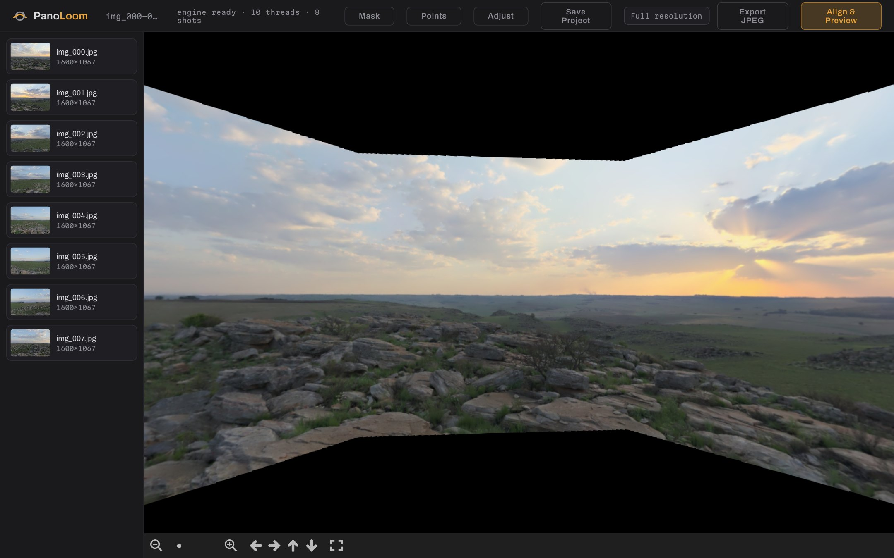
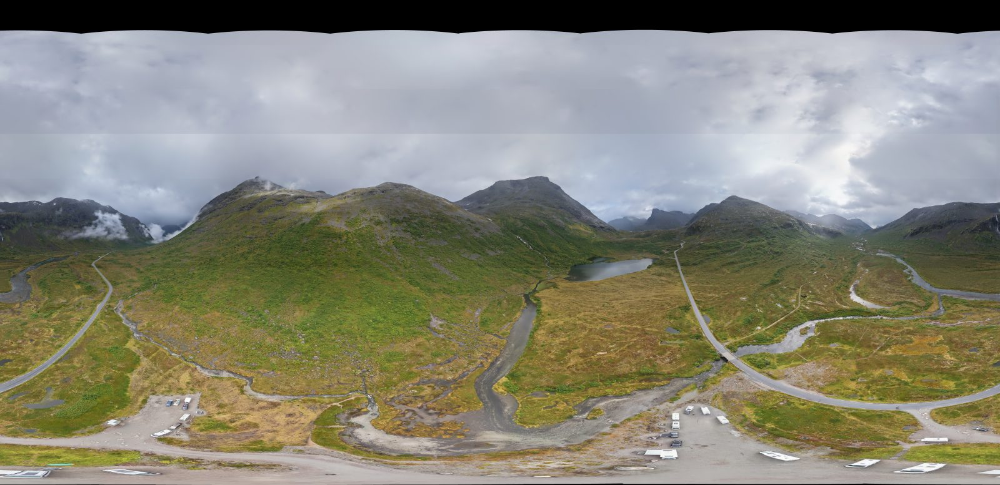
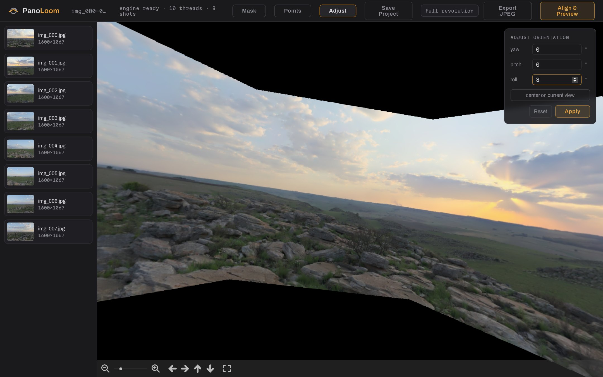
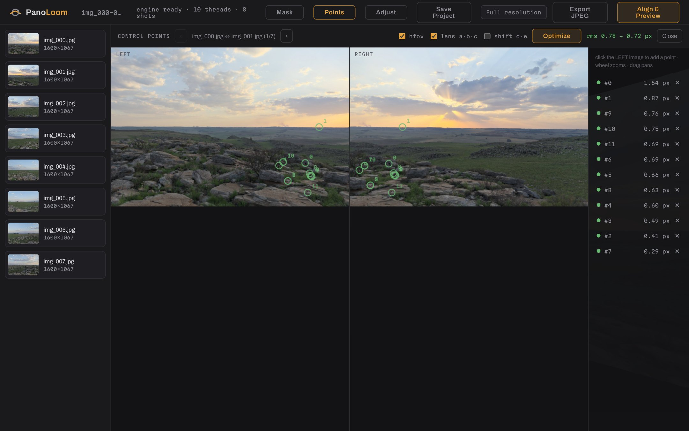
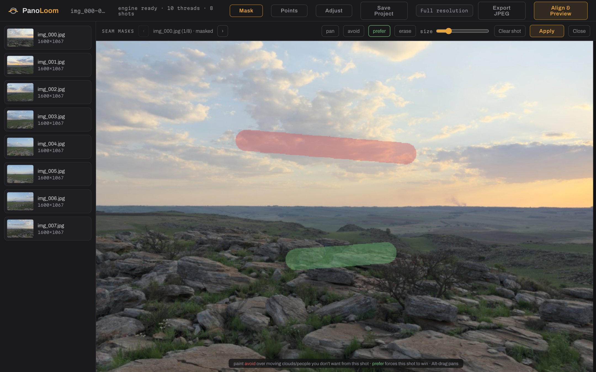
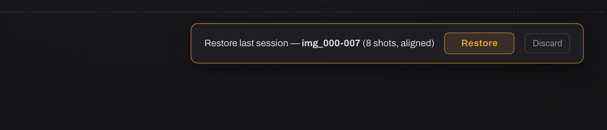

<div align="center">


# PanoLoom

**Stitch panoramas — including full 360° photos — entirely in your browser.**

Free · open source · nothing is ever uploaded

**[Open PanoLoom →](https://panoloom.pages.dev)**



</div>

---

## Stitch a panorama in three steps

1. **Drop your photos** — overlapping JPEGs from any camera, drone, or phone (or click *try a sample set*).
2. **Align & Preview** — automatic feature matching, bundle adjustment and blending; spin the result in the 360° viewer.
3. **Export JPEG** — a full-resolution panorama with Photo Sphere (GPano) metadata that Google Photos, Facebook and any 360° viewer recognize.



*A 33-shot DJI drone sphere exported at 17,172 × 8,339 px (147 MP) — stitched start to finish in a browser tab.*

## The pro layer

PanoLoom is built to replace desktop tools like PTGui for everyday spherical work, so the controls that matter are all there:

| | |
|---|---|
|  | **Recenter & level** — numeric yaw/pitch/roll or *center on current view*, previewed live and baked into the cameras so exports match exactly. |
|  | **Control points & lens optimization** — auto points from feature matches, click to add your own, then optimize rotations, field of view and a PanoTools-style radial lens model (a·b·c). Recovers synthetic ground truth to machine precision. |
|  | **Seam masks** — paint *avoid* over moving clouds, people or ghosts so seams route around them; paint *prefer* to force a shot to win. Honored by the preview and the full-res export. |
|  | **Projects & sessions** — save `.panoproj` files that restore the exact alignment without re-registering, and everything autosaves locally: close the tab and pick up where you left off. |

Also in the box: pose-metadata rescue for featureless sky shots (DJI gimbal XMP), coverage-cropped exports (no baked-in black on partial panoramas), an installable PWA that works fully offline, and a flat-preview fallback when WebGL isn't available.

## Benchmarks

The engine is a stage-by-stage Rust port of OpenCV's `stitching::detail`, validated for parity against it (many stages bit-exact — see [How it's built](#how-its-built-the-oracle-method)). That makes an apples-to-apples comparison possible: same algorithms, same test sets, OpenCV running natively with its own threading vs the PanoLoom engine.

| Test set | OpenCV 4.14 (native) | PanoLoom engine (native) | PanoLoom in the browser |
|---|---|---|---|
| Ring — 8 shots | 0.9 s | **0.4 s** | 1.4 s preview · ~8 s incl. export |
| Sphere — 26 shots | 39.7 s | **26.1 s** | — |
| DJI drone sphere — 33 × 12.6 MP | 50.4 s | **32.0 s** | 55.6 s preview · 4.2 min incl. 147 MP export |

> **And the browser tab is more robust than the desktop pipeline:** the DJI set has 8
> near-featureless sky shots. OpenCV warns `only 25/33 images connected` and leaves a
> gaping sky; PanoLoom reads the gimbal pose from each file's metadata and places all
> **33/33**.

Full methodology, hardware and caveats in [docs/benchmarks.md](docs/benchmarks.md).

## How it's built: the oracle method

The engine (`crates/panoloom-core`, pure Rust, compiled to WebAssembly with SIMD and a rayon thread pool) is a port of OpenCV's stitching pipeline (Apache-2.0, see `NOTICE`) — and every stage is gated on parity with the original:

- `tools/reference` runs the genuine OpenCV pipeline (pinned, OpenCL off) over test sets and dumps every intermediate: keypoints, descriptors, matches, cameras before/after bundle adjustment, gains, seam masks, warped images, blended output.
- Rust tests replay the same inputs and compare per stage. Many stages are bit-exact (gains, graph-cut seams, multiband pyramids); the rest are within documented tolerances.
- Deliberate deviations (RANSAC inlier re-validation, wrap-aware seam finding, pose-prior rescue, the lens model and CP optimizer — which OpenCV's stitching has no equivalent of) are documented at the call site and covered by their own tests, including a synthetic ground-truth recovery test for the optimizer.

This is why a from-scratch Rust engine can make production-quality panoramas: quality is measured against the reference at every step, not eyeballed. The full pipeline study lives in [docs/pipeline.md](docs/pipeline.md).

## Repository layout

```
crates/panoloom-core    pure Rust stitching library (native + wasm)
crates/panoloom-wasm    wasm-bindgen bindings for the browser (st + mt builds)
packages/shared         .panoproj types & pose math (TS)
packages/metadata       GPano XMP injection (TS)
packages/app            the web app (React + Vite)
tools/reference         OpenCV oracle harness (Python)
tools/testdata          synthetic ground-truth dataset generator (Python)
docs/                   pipeline study, benchmarks, README images
```

## Development

Prerequisites: Rust via rustup — stable **and nightly with `rust-src`** (the threaded
wasm build uses `-Z build-std`) — plus the `wasm32-unknown-unknown` target, Node 20+,
pnpm, wasm-pack, and Python 3.11+ if you want to run the oracle/testdata tools.

```sh
pnpm install
pnpm build:wasm       # single-thread engine -> packages/app/src/engine/pkg
pnpm build:wasm-mt    # threaded engine      -> packages/app/src/engine/pkg-mt
pnpm dev              # app dev server (COOP/COEP headers included)

cargo test            # native engine tests (parity suite needs oracle dumps)
pnpm -r test          # TS unit tests (metadata, shared)

# browser end-to-end (needs `pnpm --filter @panoloom/app build` + `vite preview`):
node packages/app/e2e/m5-stitch.mjs     # import -> align -> 360 viewer
node packages/app/e2e/m6-adjust.mjs     # live orientation preview == baked result
node packages/app/e2e/m7-export.mjs     # cropped full-res export + GPano validation
node packages/app/e2e/m8-project.mjs    # project save/load round-trip
node packages/app/e2e/m8-sample.mjs     # bundled sample set
node packages/app/e2e/m9-cp-editor.mjs  # control points + lens optimize
node packages/app/e2e/m10-mask.mjs      # seam masks move the seam
node packages/app/e2e/m11-restore.mjs   # session autosave -> restore
# any of the above also run cross-engine: BROWSER=webkit|firefox node ...
node packages/app/e2e/screenshots.mjs   # regenerate the README screenshots
```

Stage-level profiling of the engine on a directory of registration-scale PNGs:

```sh
PANOLOOM_TIMING=1 cargo run --release --example profile_align -- <dir> [priors.json]
```

Icons are generated from the SVG sources with `tools/render-icons.sh` (needs librsvg).

## Roadmap

v1.x: AKAZE/SIFT for low-texture scenes. Later: RAW input, HDR/exposure fusion,
vignetting optimization, WebGPU compositing, 16-bit TIFF, more projections.

## License

Apache-2.0. See [LICENSE](LICENSE) and [NOTICE](NOTICE) (OpenCV-derived portions).
The bundled sample set is rendered from a CC0 HDRI by [Poly Haven](https://polyhaven.com).
